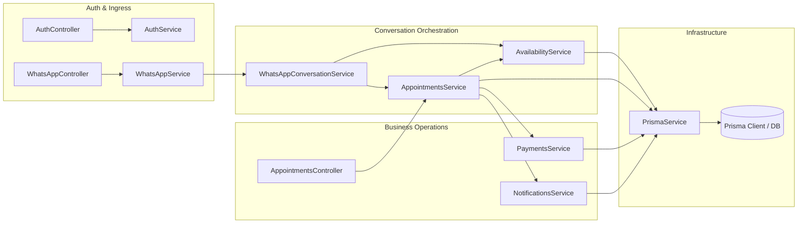

# System Architecture & Technical Design

This document details the software architecture, design patterns, multi-tenant isolation model, and concurrency guarantees of the **WhatsApp SaaS** platform.

---

## 1. High-Level Architecture Overview

WhatsApp SaaS is designed as an event-driven, decoupled multi-tenant appointment scheduling and customer retention platform. It unites conversational commerce (WhatsApp Business Cloud API) with a business operations control plane (Next.js 16 Dashboard).

```mermaid
flowchart TB
    subgraph Clients["Client Layer"]
        WA_User["WhatsApp Customer\n(Mobile Device)"]
        Dashboard_User["Business Owner / Admin\n(Web Browser)"]
    end

    subgraph Edge["Ingress & Edge"]
        Meta_Cloud["Meta Graph API\n(WhatsApp Cloud v20.0)"]
        Nginx["Reverse Proxy / SSL / CORS\n(Port 80/443)"]
    end

    subgraph Backend["NestJS Modular Application (Port 3001)"]
        direction TB
        AuthGuard["JWT Auth Guard & Roles Decorator"]
        WebhookController["WhatsApp Webhook Controller\n(Challenge & Signature Verifier)"]
        
        subgraph CoreModules["Core Domain Modules"]
            WA_FSM["WhatsApp Conversation Engine\n(FSM & Mutex Locks)"]
            AvailEngine["Availability Engine\n(Working Hours, Breaks, Overlaps)"]
            ApptEngine["Appointment Engine\n(Staff Mutex Lock & Status Lifecycle)"]
            PayEngine["Payment Engine\n(Deposit Modes & Razorpay Provider)"]
            NotifEngine["Notification Cron Engine\n(24h/2h Reminders & 30s Polling)"]
            RetEngine["Retention Engine\n(30-day Post-Visit Reactivation)"]
        end
    end

    subgraph Storage["Data & Persistence Layer"]
        PrismaORM["Prisma ORM (v5.22.0)"]
        Database[(Relational Database\nSQLite for Dev | PostgreSQL for Prod)]
    end

    WA_User <-->|Instant Messages| Meta_Cloud
    Meta_Cloud <-->|POST /api/v1/whatsapp/webhook| WebhookController
    Dashboard_User <-->|Next.js React 19 Client| Nginx
    Nginx <-->|REST API + Bearer JWT| Backend
    WebhookController --> WA_FSM
    WA_FSM --> AvailEngine
    WA_FSM --> ApptEngine
    ApptEngine --> PayEngine
    Backend --> PrismaORM
    PrismaORM --> Database
    NotifEngine -->|Meta Graph API / Simulator| Meta_Cloud
    RetEngine -->|Automated Follow-ups| WA_FSM
```

---

## 2. Multi-Tenancy Architecture

The platform uses a **shared-database, multi-tenant logical isolation** architecture. 

### Logical Tenant Isolation (`businessId`)
Every tenant is represented by a `Business` entity. All subordinate entities in the database are partitioned by `businessId`:
- `User` (Staff, Admin, Owner)
- `Customer` (Scoped per business; phone number uniquely identified per business)
- `Service` (Catalog and pricing)
- `Staff` (Team members and specialists)
- `Appointment` (Booking records)
- `Payment` & `PaymentSettings`
- `ReminderSettings` & `NotificationLog`
- `RetentionSettings` & `RetentionFollowUp`

### Request-Level Tenant Scoping
- **Dashboard API Requests**: Enforced via Passport JWT authentication (`JwtAuthGuard`). The token payload encodes the authenticated user's `userId`, `businessId`, and `role`. Controllers query and mutate data strictly with `where: { businessId: req.user.businessId }`.
- **WhatsApp Webhook Ingress**: The incoming message payload contains the recipient's WhatsApp Phone Number ID (`metadata.phone_number_id`). The system queries `business.findFirst({ where: { whatsappPhoneNumberId: recipientId } })` to resolve the tenant context before any conversation processing begins.

---

## 3. Backend Module Hierarchy & Dependency Injection

The NestJS backend is organized into bounded contexts:

```
src/
├── app.module.ts                         # Root application module orchestrating all domains
├── prisma.service.ts                     # Lifecycle-managed Prisma Client singleton
├── app.controller.ts                     # Root health check endpoint (/api/v1/health)
├── auth/                                 # Authentication, JWT strategy, bcrypt password hashing
├── business/                             # Business entity profiles and operational hours
├── services/                             # Service catalog, pricing, duration, and buffer minutes
├── staff/                                # Staff member schedules, breaks, and leaves
├── holidays/                             # Tenant business closure dates
├── availability/                         # Dynamic slot computation engine
├── appointments/                         # Booking lifecycle and concurrency locking
├── customers/                            # Customer history, notes, and visit metrics
├── whatsapp/                             # Webhook reception, validation, and outbound dispatch
├── whatsapp-conversation/                # Deterministic 8-state FSM booking dialogue
├── payments/                             # Deposit calculation, payment links, and webhook reconciliation
├── notifications/                        # Background reminder cron and delivery logging
└── retention/                            # Post-appointment follow-up scheduling & churn prevention
```

### Dependency Graph & Data Flow



---

## 4. Concurrency & Race Condition Guarantees

In appointment booking platforms, two customers attempting to book the exact same staff member for the same time slot can lead to disastrous double-bookings.

WhatsApp SaaS implements a **multi-tiered concurrency defense**:

### 1. In-Memory Staff Mutex Locking
Located in `src/appointments/appointments.service.ts`:
```typescript
private staffLocks = new Map<string, Promise<void>>();

private async acquireStaffLock(staffId: string): Promise<() => void> {
  while (this.staffLocks.has(staffId)) {
    await this.staffLocks.get(staffId);
  }
  let unlock: () => void;
  const lockPromise = new Promise<void>((resolve) => {
    unlock = resolve;
  });
  this.staffLocks.set(staffId, lockPromise);
  return () => {
    this.staffLocks.delete(staffId);
    unlock();
  };
}
```
When a booking request enters `create()`:
1. `acquireStaffLock(staffId)` intercepts the thread for that specific staff member.
2. Concurrent requests for the same staff member are paused until the active request finishes.
3. Requests for *different* staff members execute fully in parallel.

### 2. Double-Check Inside Critical Section
Even with queueing, after acquiring the lock, `create()` re-evaluates database conflicts:
```typescript
const conflict = await this.prisma.appointment.findFirst({
  where: {
    staffId: data.staffId,
    status: { in: ['PENDING', 'CONFIRMED'] },
    OR: [
      { startTime: { lte: startTime }, endTime: { gt: startTime } },
      { startTime: { lt: endTime }, endTime: { gte: endTime } },
      { startTime: { gte: startTime }, endTime: { lte: endTime } },
    ],
  },
});
if (conflict) {
  throw new ConflictException('Staff member is already booked for this time window');
}
```

### 3. WhatsApp Session Mutex
Located in `src/whatsapp-conversation/whatsapp-conversation.service.ts`:
```typescript
private sessionLocks = new Map<string, Promise<void>>();
```
Prevents race conditions when a user sends rapid-fire WhatsApp messages (e.g., typing multiple numbers within milliseconds). Each user's phone number has an isolated FIFO queue.

---

## 5. Background Jobs & Scheduled Workers

The platform utilizes `@nestjs/schedule` for periodic cron workflows:

| Worker Service | Schedule | Functionality |
| :--- | :--- | :--- |
| `NotificationSchedulerService` | Every 30 seconds (`*/30 * * * * *`) | Scans `Appointment` records. Calculates 24-hour and 2-hour reminder windows against `ReminderSettings`. Dispatches WhatsApp notifications with idempotency checks. |
| `RetentionSchedulerService` | Daily at 09:00 AM | Scans completed appointments older than 30 days without subsequent bookings. Schedules re-engagement WhatsApp discount vouchers. |
| `PaymentExpiryScheduler` | Every 5 minutes | Flags unpaid appointments whose deposit payment links have exceeded the configured expiry TTL (e.g., 15 minutes) and transitions them to `CANCELLED`. |

---

## 6. Frontend Architecture (Next.js 16 Control Plane)

The business dashboard is built with **Next.js 16 App Router**, **React 19**, and **Tailwind CSS**:

```
frontend/src/app/
├── layout.tsx                            # Root HTML layout with Inter font and CSS tokens
├── page.tsx                              # Landing page with live API health status indicator
├── login/page.tsx                        # Business owner authentication screen
├── register/page.tsx                     # New tenant onboarding and business registration
└── dashboard/
    ├── layout.tsx                        # Responsive dashboard shell (sidebar navigation + header)
    ├── page.tsx                          # Business overview metrics (revenue, appointments, retention)
    ├── appointments/page.tsx             # Interactive calendar and tabular appointment management
    ├── customers/page.tsx                # Customer CRM directory with lifetime value & history
    ├── customers/[id]/page.tsx           # Individual customer dossier
    ├── services/page.tsx                 # Service catalog CRUD, pricing, duration, buffer settings
    ├── staff/page.tsx                    # Staff directory and assignment
    ├── staff/[id]/page.tsx               # Granular staff schedule: working hours, breaks, leaves
    ├── holidays/page.tsx                 # Business closures and holiday management
    ├── payments/page.tsx                 # Deposit configurations, transaction history, refunds
    ├── notifications/page.tsx            # Automated reminder delivery logs and notification templates
    ├── retention/page.tsx                # Churn analysis, re-engagement campaign settings
    └── whatsapp/page.tsx                 # Interactive WhatsApp interactive simulator & live Meta configuration
```

---

## 7. Storage Engine: Dual-Mode Database Support

The application is engineered to work frictionlessly in two environments:

1. **Development & Zero-Dependency Testing**:
   - **Engine**: SQLite via Prisma ORM (`file:./dev.db`).
   - **Benefit**: No Docker or external database daemon required for instant evaluation.
2. **Production Staging & High Concurrency**:
   - **Engine**: PostgreSQL 15 Alpine via Docker Compose.
   - **Benefit**: Native connection pooling, row-level locking, and high-concurrency transactions.
