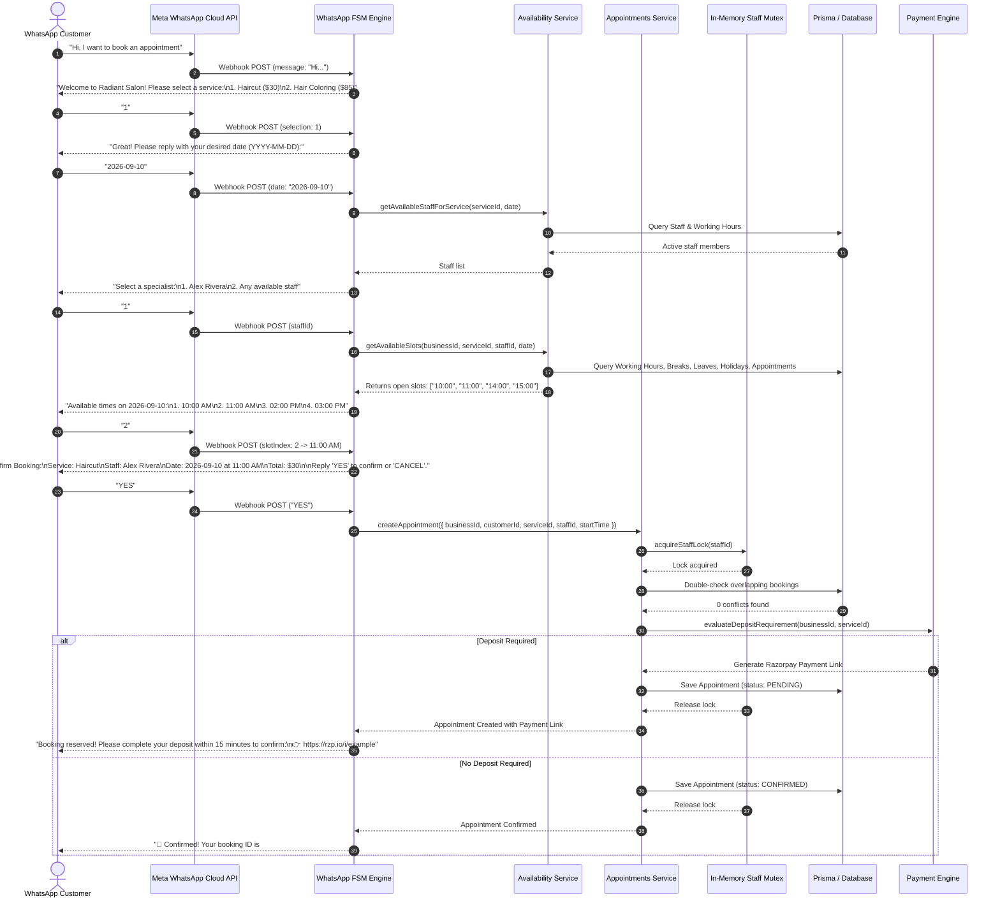
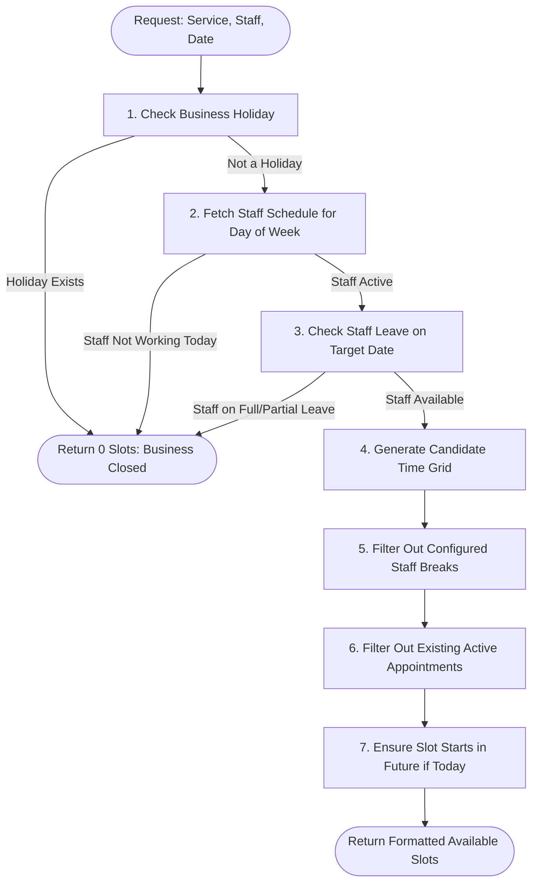
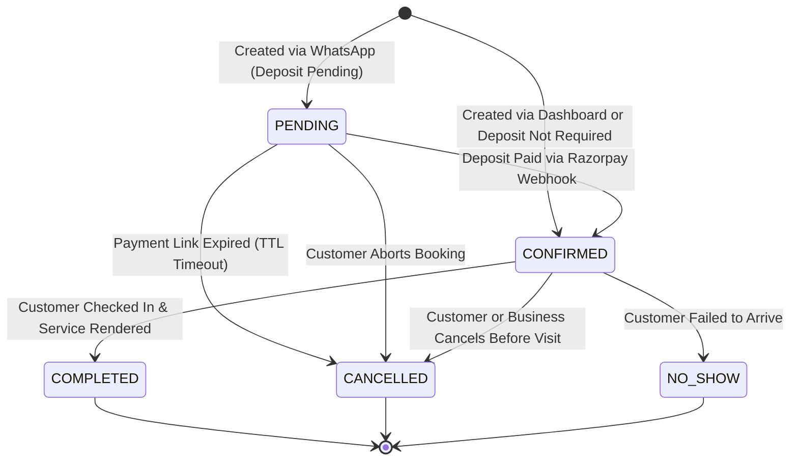

# Appointment Booking Engine & Slot Calculation Algorithm

This document details the internal mathematics, constraints, slot generation algorithm, and state lifecycle governing appointment bookings in **WhatsApp SaaS**.

---

## 1. End-to-End Customer Booking Journey



---

## 2. Slot Calculation Algorithm

The availability engine (`src/availability/availability.service.ts`) calculates open booking slots dynamically without pre-generating static calendar entries. This guarantees real-time accuracy across changes in staff rosters, breaks, and emergency leaves.

### Inputs to the Algorithm
1. `businessId`: Tenant identifier.
2. `serviceId`: Determines `duration` (in minutes) and `bufferTime` (turnaround padding).
3. `staffId`: The selected team member (or wildcard for all qualified staff).
4. `date`: Target date in `YYYY-MM-DD` format.

```
Total Required Time Window = Service Duration + Service Buffer Time
```
*Example: A 45-minute massage with 15 minutes of room sanitization requires a continuous 60-minute window.*

---

### Step-by-Step Slot Filtering Pipeline



#### Detailed Pipeline Stages:

1. **Business Holiday Validation**:
   - Queries `prisma.holiday.findFirst({ where: { businessId, date } })`.
   - If present, the business is completely closed. Return an empty array `[]`.

2. **Staff Shift & Working Hours**:
   - Extracts the day of the week (`SUNDAY` through `SATURDAY`).
   - Queries `prisma.staffWorkingHours.findFirst({ where: { staffId, dayOfWeek } })`.
   - Reads `startTime` (e.g., `09:00`) and `endTime` (e.g., `18:00`). If `isWorking = false`, return `[]`.

3. **Staff Approved Leave**:
   - Queries `prisma.staffLeave.findMany({ where: { staffId, startDate <= date, endDate >= date, status: 'APPROVED' } })`.
   - If an approved leave covers this date, return `[]`.

4. **Candidate Time Grid Generation**:
   - Iterates in increments matching the service interval (e.g., every 30 or 60 minutes) from shift start to shift end minus duration:
     $$\text{slotEndTime} = \text{slotStartTime} + \text{duration} + \text{bufferTime}$$
   - Any candidate slot whose $\text{slotEndTime} > \text{shiftEndTime}$ is immediately discarded.

5. **Staff Break Subtraction**:
   - Queries `prisma.staffBreak.findMany({ where: { staffId, dayOfWeek } })`.
   - Any candidate slot overlapping with a staff break (e.g., Lunch `13:00 - 14:00`) is pruned:
     $$\text{Overlap} \iff (\text{slotStart} < \text{breakEnd}) \land (\text{slotEnd} > \text{breakStart})$$

6. **Existing Appointment Conflict Pruning**:
   - Queries `prisma.appointment.findMany({ where: { staffId, date, status: { in: ['PENDING', 'CONFIRMED'] } } })`.
   - Any candidate slot overlapping with an existing active appointment is pruned.
   - Cancelled (`CANCELLED`) and No-Show (`NO_SHOW`) appointments do not block slots.

7. **Past-Time Pruning (Same-Day Requests)**:
   - If the requested date is today, candidate slots earlier than `currentTime + leadTime` (e.g., 30 minutes notice) are filtered out.

---

## 3. Appointment Lifecycle & State Machine

Every appointment moves through well-defined lifecycle states:



### State Definitions

| Status | Description | Slot Release Behavior |
| :--- | :--- | :--- |
| `PENDING` | Slot temporarily held awaiting customer deposit payment (15 min TTL). | **Held**: Blocks other customers from booking this slot. |
| `CONFIRMED` | Fully confirmed booking with or without deposit. Reminders will fire. | **Held**: Slot is strictly locked. |
| `COMPLETED` | Appointment fulfilled. Triggers 30-day retention campaign counter. | **Released**: Becomes historical record. |
| `CANCELLED` | Booking cancelled by customer or business, or expired unpaid. | **Instantly Released**: Slot immediately becomes available to others. |
| `NO_SHOW` | Customer did not show up. Retained for customer reliability analytics. | **Released**: Historical record. |

---

## 4. Concurrency Protection & Overlap Prevention

Race conditions occur when two customers concurrently request the last remaining slot (e.g., 10:00 AM with Stylist Sarah):

```
Time T0: Customer A requests 10:00 AM (Sarah)
Time T1: Customer B requests 10:00 AM (Sarah)
```

Without concurrency locks, both requests query the database at T2, both observe that 10:00 AM is free, and both insert appointments at T3, producing a **double-booking**.

### Solution: In-Memory Mutex Lock (`acquireStaffLock`)
In `AppointmentsService`:
```typescript
async create(data: CreateAppointmentDto) {
  // 1. Acquire mutex lock scoped to this specific staff member
  const releaseLock = await this.acquireStaffLock(data.staffId);
  try {
    // 2. Re-verify inside critical section
    const conflict = await this.prisma.appointment.findFirst({
      where: {
        staffId: data.staffId,
        status: { in: ['PENDING', 'CONFIRMED'] },
        OR: [
          { startTime: { lte: data.startTime }, endTime: { gt: data.startTime } },
          { startTime: { lt: data.endTime }, endTime: { gte: data.endTime } },
          { startTime: { gte: data.startTime }, endTime: { lte: data.endTime } },
        ],
      },
    });

    if (conflict) {
      throw new ConflictException('This time slot was just booked by another customer.');
    }

    // 3. Persist appointment safely
    return await this.prisma.appointment.create({ data });
  } finally {
    // 4. Release lock so queued requests can proceed safely
    releaseLock();
  }
}
```

This guarantees that concurrent requests for the **same staff member are strictly serialized**, while bookings for **different staff members execute at full parallel throughput**.
