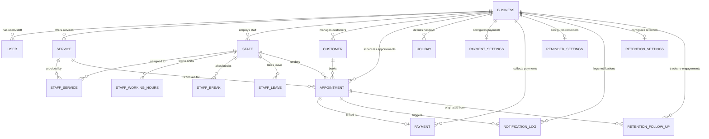

# Database Architecture & Data Dictionary

This document details the database schema, entity-relationship diagrams (ERD), table structures, foreign keys, and indexes used across the **WhatsApp SaaS** platform.

---

## 1. Entity-Relationship Diagram (ERD)

---

## 2. Comprehensive Model Catalogue (16 Models)

### 2.1 Core Multi-Tenancy & Identity

#### `Business`
The root tenant record. Every business registered on the platform operates in complete logical isolation.
- `id` (String, UUID/CUID, Primary Key)
- `name` (String): Business display name (e.g., "Radiant Hair Salon").
- `slug` (String, Unique): URL-safe tenant identifier.
- `email` (String), `phone` (String), `address` (String)
- `whatsappPhoneNumberId` (String, Nullable): Meta Phone Number ID.
- `whatsappAccessToken` (String, Nullable): Meta System User Graph API access token.
- `createdAt`, `updatedAt` (DateTime)

#### `User`
Accounts for business owners, administrators, and staff members.
- `id` (String, Primary Key)
- `businessId` (String, Foreign Key -> `Business.id`)
- `email` (String, Unique within tenant)
- `password` (String): Securely hashed with `bcryptjs` (salt rounds: 10).
- `role` (Enum): `OWNER`, `ADMIN`, `STAFF`.
- `name` (String)

---

### 2.2 Catalog & Staff Scheduling

#### `Service`
Items offered by the business with duration, pricing, and turn-around buffer requirements.
- `id` (String, Primary Key)
- `businessId` (String, Foreign Key -> `Business.id`)
- `name` (String): e.g., "Deep Tissue Massage".
- `description` (String, Nullable)
- `duration` (Int): Active service time in minutes (e.g., 45).
- `bufferTime` (Int): Preparation/sanitization padding in minutes (e.g., 15).
- `price` (Float): Full service price in base currency.
- `isActive` (Boolean, Default: true)

#### `Staff`
Team members who fulfill appointments.
- `id` (String, Primary Key)
- `businessId` (String, Foreign Key -> `Business.id`)
- `name` (String), `email` (String), `phone` (String)
- `color` (String): Hex color code for calendar dashboard visualization.
- `isActive` (Boolean, Default: true)

#### `StaffService` (Junction Table)
Many-to-many relationship mapping which staff members are certified/scheduled to provide which services.
- `id` (String, Primary Key)
- `staffId` (String, Foreign Key -> `Staff.id`)
- `serviceId` (String, Foreign Key -> `Service.id`)

#### `StaffWorkingHours`
Weekly recurring shift hours for a staff member.
- `id` (String, Primary Key)
- `staffId` (String, Foreign Key -> `Staff.id`)
- `dayOfWeek` (Enum): `MONDAY`, `TUESDAY`, `WEDNESDAY`, `THURSDAY`, `FRIDAY`, `SATURDAY`, `SUNDAY`
- `startTime` (String): Shift start in `HH:mm` format (e.g., `"09:00"`).
- `endTime` (String): Shift end in `HH:mm` format (e.g., `"18:00"`).
- `isWorking` (Boolean, Default: true)

#### `StaffBreak`
Recurring pauses during a staff shift (e.g., Lunch, Administrative time).
- `id` (String, Primary Key)
- `staffId` (String, Foreign Key -> `Staff.id`)
- `dayOfWeek` (Enum): Day of week the break applies to.
- `startTime` (String): e.g., `"13:00"`.
- `endTime` (String): e.g., `"14:00"`.
- `title` (String): Label for the break (e.g., "Lunch Break").

#### `StaffLeave`
Approved non-recurring time-off, vacations, or sick days for specific date ranges.
- `id` (String, Primary Key)
- `staffId` (String, Foreign Key -> `Staff.id`)
- `startDate` (String): Start date (`YYYY-MM-DD`).
- `endDate` (String): End date (`YYYY-MM-DD`).
- `reason` (String, Nullable)
- `status` (Enum): `PENDING`, `APPROVED`, `REJECTED`

#### `Holiday`
Tenant-wide closure dates (e.g., National Holidays, Renovations).
- `id` (String, Primary Key)
- `businessId` (String, Foreign Key -> `Business.id`)
- `date` (String): Date of closure (`YYYY-MM-DD`).
- `title` (String): Holiday name (e.g., "New Year's Day").

---

### 2.3 Customers & Bookings

#### `Customer`
CRM profiles for clients booking via WhatsApp or Dashboard.
- `id` (String, Primary Key)
- `businessId` (String, Foreign Key -> `Business.id`)
- `phone` (String): International E.164 format (e.g., `+1234567890`).
- `name` (String, Nullable)
- `email` (String, Nullable)
- `notes` (String, Nullable): Allergies, preferences, VIP notes.
- `totalVisits` (Int, Default: 0)
- `totalSpent` (Float, Default: 0.0)

#### `Appointment`
The core scheduling record.
- `id` (String, Primary Key)
- `businessId` (String, Foreign Key -> `Business.id`)
- `customerId` (String, Foreign Key -> `Customer.id`)
- `serviceId` (String, Foreign Key -> `Service.id`)
- `staffId` (String, Foreign Key -> `Staff.id`)
- `date` (String): Date formatted as `YYYY-MM-DD`.
- `startTime` (String): Slot start time formatted as `HH:mm`.
- `endTime` (String): Slot end time formatted as `HH:mm`.
- `status` (Enum): `PENDING`, `CONFIRMED`, `COMPLETED`, `CANCELLED`, `NO_SHOW`
- `notes` (String, Nullable)
- `createdAt`, `updatedAt` (DateTime)

---

### 2.4 Payments & Gateway Integration

#### `PaymentSettings`
Configures deposit policies and gateway credentials per business.
- `id` (String, Primary Key)
- `businessId` (String, Unique Foreign Key -> `Business.id`)
- `enabled` (Boolean, Default: false)
- `depositType` (Enum): `FIXED`, `PERCENTAGE`, `FULL_PAYMENT`
- `depositValue` (Float): Amount in currency or percentage rate (0-100).
- `currency` (String, Default: "INR")
- `provider` (Enum): `MOCK`, `RAZORPAY`
- `keyId` (String, Nullable), `keySecret` (String, Nullable), `webhookSecret` (String, Nullable)

#### `Payment`
Payment transactions and deposit audit log.
- `id` (String, Primary Key)
- `businessId` (String, Foreign Key -> `Business.id`)
- `appointmentId` (String, Unique Foreign Key -> `Appointment.id`)
- `orderId` (String, Nullable): Razorpay Order ID.
- `paymentId` (String, Nullable): Gateway transaction reference.
- `amount` (Float): Amount paid.
- `currency` (String)
- `status` (Enum): `PENDING`, `PAID`, `FAILED`, `REFUNDED`
- `paymentUrl` (String, Nullable): Razorpay Hosted Payment Link.
- `refundId` (String, Nullable), `refundAmount` (Float, Nullable)

---

### 2.5 Reminders & Retention Marketing

#### `ReminderSettings`
Automated reminder rules per tenant.
- `id` (String, Primary Key)
- `businessId` (String, Unique Foreign Key -> `Business.id`)
- `enable24h` (Boolean, Default: true): Fire reminder 24 hours before visit.
- `enable2h` (Boolean, Default: true): Fire reminder 2 hours before visit.
- `customMessage24h` (String, Nullable): Customized WhatsApp copy.
- `customMessage2h` (String, Nullable): Customized WhatsApp copy.

#### `NotificationLog`
Audit log of all outbound WhatsApp automated alerts.
- `id` (String, Primary Key)
- `businessId` (String, Foreign Key -> `Business.id`)
- `appointmentId` (String, Foreign Key -> `Appointment.id`)
- `type` (Enum): `CONFIRMATION`, `REMINDER_24H`, `REMINDER_2H`, `CANCELLATION`, `RETENTION`
- `recipient` (String): Target phone number.
- `status` (Enum): `SENT`, `FAILED`, `PENDING`
- `sentAt` (DateTime, Default: now)
- `error` (String, Nullable)

#### `RetentionSettings`
Rules for automated re-engagement of dormant clients.
- `id` (String, Primary Key)
- `businessId` (String, Unique Foreign Key -> `Business.id`)
- `enabled` (Boolean, Default: true)
- `daysAfterVisit` (Int, Default: 30): Inactivity trigger threshold.
- `discountCode` (String, Nullable): Promotional coupon (e.g., `"COMEBACK15"`).
- `customMessage` (String, Nullable)

#### `RetentionFollowUp`
Individual re-engagement delivery records.
- `id` (String, Primary Key)
- `businessId` (String, Foreign Key -> `Business.id`)
- `customerId` (String, Foreign Key -> `Customer.id`)
- `appointmentId` (String, Foreign Key -> `Appointment.id`)
- `scheduledFor` (DateTime): Date to fire the follow-up message.
- `status` (Enum): `SCHEDULED`, `SENT`, `CONVERTED`, `CANCELLED`
- `sentAt` (DateTime, Nullable)

---

## 3. SQLite vs PostgreSQL Support

WhatsApp SaaS provides full dual-database compatibility:

| Feature | SQLite (`file:./dev.db`) | PostgreSQL (`postgres:15-alpine`) |
| :--- | :--- | :--- |
| **Primary Use Case** | Local development, rapid testing, zero setup. | Staging, production deployment, cloud hosting. |
| **Setup Overhead** | Zero dependencies, instant run. | Managed via Docker Compose (`docker-compose up -d`). |
| **Concurrency** | File-level lock (serialized writes). | Row-level locking (MVCC), high concurrent throughput. |
| **Foreign Keys** | Supported via Prisma Client. | Native relational enforcement at the engine level. |
| **Switching Method** | Change `provider = "sqlite"` in `schema.prisma`. | Change `provider = "postgresql"` in `schema.prisma`. |
