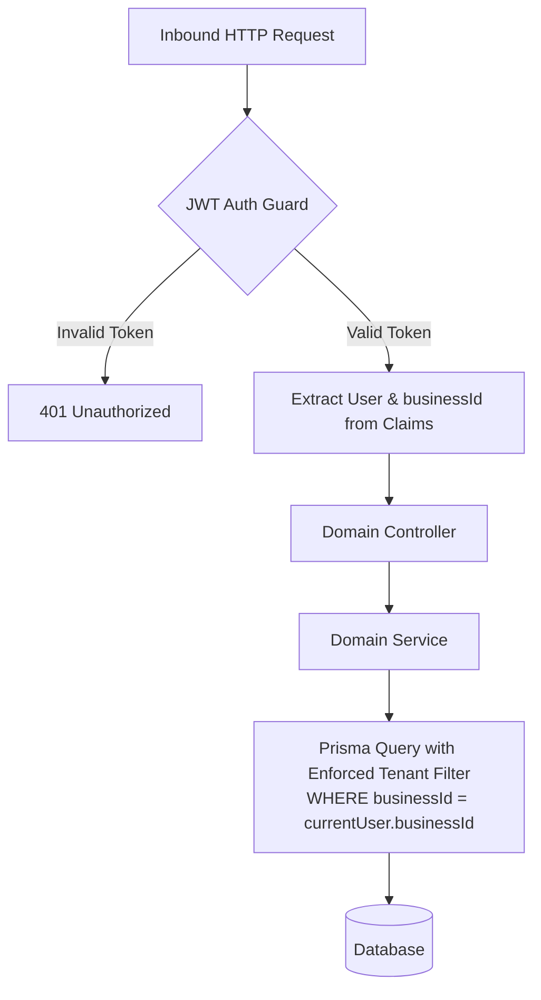

# Security & Data Isolation Architecture

This document details the security model, cryptographic protocols, tenant isolation mechanisms, and attack mitigations implemented in **WhatsApp SaaS**.

---

## 1. Multi-Tenant Logical Isolation

Multi-tenancy security is enforced through a **strict tenant-scoped persistence model**.



### Security Invariants:
1. **Tenant Isolation Guarantee**: No query in the service layer ever mutates or accesses records across tenant boundaries. Every `find`, `create`, `update`, and `delete` explicitly anchors to `where: { businessId: user.businessId }`.
2. **Horizontal Privilege Escalation Mitigation**: Even if an attacker guesses the UUID of another business's appointment (`apt_12345`), requests attempting `DELETE /api/v1/appointments/apt_12345` evaluate:
   ```typescript
   await this.prisma.appointment.findFirst({
     where: { id, businessId: user.businessId }
   });
   ```
   If the record belongs to another business, it evaluates to `null` and throws a `404 Not Found`, preventing unauthorized read or write access.

---

## 2. Authentication & Credential Management

- **Password Hashing**: User passwords are encrypted using `bcryptjs` with **10 salt rounds**. Raw passwords are never persisted to disk or emitted in logs.
- **JWT Authentication Tokens**: Authentication tokens are digitally signed with HMAC SHA-256 via `@nestjs/jwt`.
- **Role-Based Access Control (RBAC)**:
  - `OWNER`: Full control over tenant profile, staff, services, billing, and API tokens.
  - `ADMIN`: Operational management (appointments, calendar, manual bookings, refunds).
  - `STAFF`: Restricted access to individual schedules, appointments, and roster view.

---

## 3. Webhook Authentication & Cryptographic Signatures

### Meta Cloud API Webhook (`X-Hub-Signature-256`)
Inbound webhook payloads from Meta are validated to prevent spoofing or replay attacks:
```typescript
const signature = req.headers['x-hub-signature-256'];
const expectedSignature = 'sha256=' + crypto
  .createHmac('sha256', process.env.META_APP_SECRET)
  .update(rawBody)
  .digest('hex');

if (!crypto.timingSafeEqual(Buffer.from(signature), Buffer.from(expectedSignature))) {
  throw new UnauthorizedException('Invalid HMAC webhook signature');
}
```
*Note: Constant-time comparison (`crypto.timingSafeEqual`) eliminates timing attack vulnerabilities.*

### Razorpay Webhook Verification
Payment notifications are authenticated against the tenant's or global webhook secret:
```typescript
const generatedSignature = crypto
  .createHmac('sha256', webhookSecret)
  .update(JSON.stringify(req.body))
  .digest('hex');
```

---

## 4. Race Condition & Concurrency Defense

Double bookings in service businesses lead to severe customer dissatisfaction and operational chaos.

1. **Staff Mutex Lock (`acquireStaffLock`)**: Ensures that two simultaneous requests attempting to book the same staff member are processed sequentially.
2. **Session Mutex Lock (`acquireSessionLock`)**: Ensures that rapid-fire WhatsApp messages from the same mobile user do not corrupt conversation state.
3. **Database Re-Verification**: Re-evaluates overlaps inside the mutex critical section right before database commit.

---

## 5. Defense-in-Depth Checklist

| Security Control | Implementation | Verification |
| :--- | :--- | :--- |
| **CORS Filtering** | Explicitly configured in `main.ts` | Tested via browser cross-origin requests |
| **Secrets Exposure** | `.gitignore` filters `.env`, `.env.local`, SQLite DBs | Validated against git index |
| **SQL Injection** | Prisma ORM utilizes parameterized prepared queries | Zero raw string interpolation in queries |
| **XSS Defense** | Next.js automatically escapes React JSX templates | Verified across all dashboard inputs |
| **Inactivity Timeout** | WhatsApp sessions reset after 30 minutes of idle time | Verified in `WhatsAppConversationService` |
