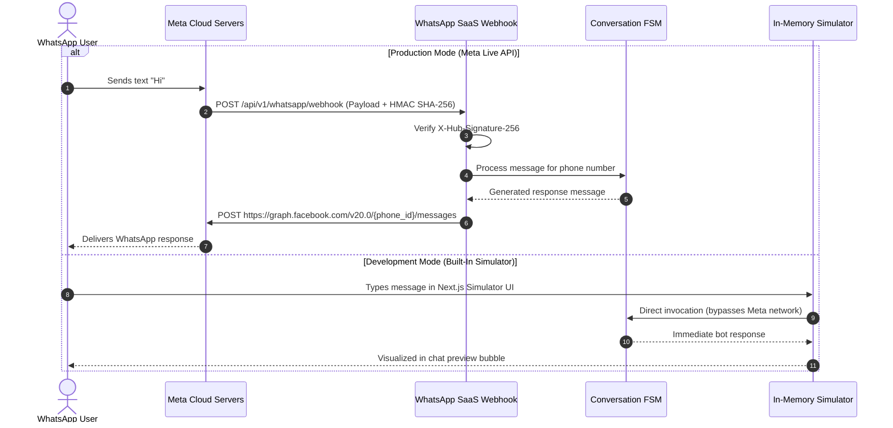
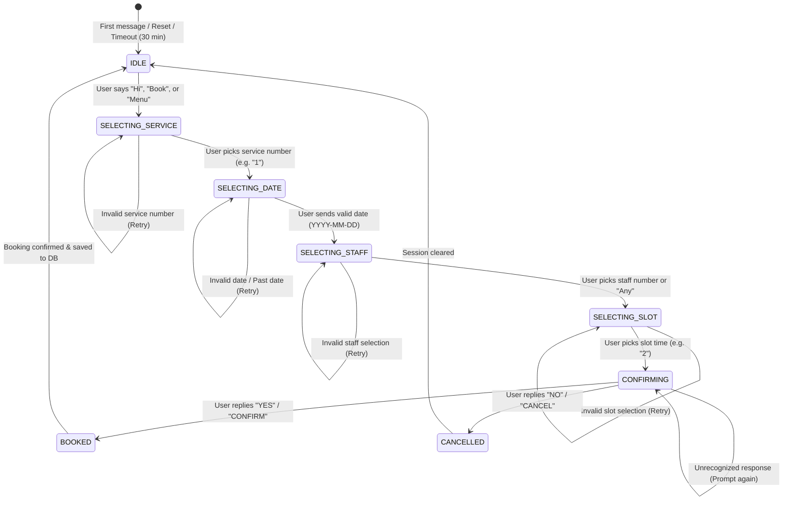

# WhatsApp Automation & Conversational Engine (FSM)

This document explains the architecture of the **WhatsApp Business Cloud API integration**, the deterministic **8-state Finite State Machine (FSM)**, and the **built-in interactive simulator**.

---

## 1. WhatsApp Ingress & Meta Cloud API Architecture

The platform communicates with Meta's official **WhatsApp Business Cloud API (Graph API v20.0)**.



---

## 2. Webhook Verification & Security

Meta requires two types of verification:

### 1. Webhook Challenge Verification (`GET /api/v1/whatsapp/webhook`)
When registering the webhook in the Meta Developer Portal, Meta sends a GET handshake:
- `hub.mode`: Set to `"subscribe"`
- `hub.verify_token`: Verified against `process.env.WHATSAPP_VERIFY_TOKEN`
- `hub.challenge`: Echoed back as plain text with HTTP 200

```typescript
@Get('webhook')
verifyWebhook(
  @Query('hub.mode') mode: string,
  @Query('hub.verify_token') token: string,
  @Query('hub.challenge') challenge: string,
) {
  if (mode === 'subscribe' && token === process.env.WHATSAPP_VERIFY_TOKEN) {
    return challenge;
  }
  throw new ForbiddenException('Invalid verification token');
}
```

### 2. Message Payload Ingress (`POST /api/v1/whatsapp/webhook`)
Inbound messages arrive with the header `X-Hub-Signature-256`. The server verifies that:
$$\text{HMAC-SHA256}(\text{rawPayload}, \text{APP\_SECRET}) == \text{X-Hub-Signature-256}$$
This guarantees that inbound webhooks originate authentically from Meta's infrastructure.

---

## 3. The 8-State Finite State Machine (FSM)

Rather than relying on non-deterministic LLMs for critical booking steps (which can hallucinate non-existent appointment slots or incorrect pricing), WhatsApp SaaS utilizes a **deterministic Finite State Machine**.



### State Definitions & Context

| State | Prompt Sent to Customer | Expected User Reply | System Action |
| :--- | :--- | :--- | :--- |
| `IDLE` | Welcome banner, business name, and main menu options. | Keyword (`"book"`, `"hi"`, `"help"`, `"cancel"`). | Initializes user session, loads active service catalog. |
| `SELECTING_SERVICE` | Numbered list of available services with duration & pricing. | Numeric index (`1`, `2`, `3`). | Validates service ID, saves selection to session context. |
| `SELECTING_DATE` | Date entry request (`YYYY-MM-DD` or `"tomorrow"`). | Date string format. | Validates date is in future and business is not on holiday. |
| `SELECTING_STAFF` | Available specialists qualified for the selected service. | Numeric index or `"0"` for any staff. | Filters active staff schedule for that day. |
| `SELECTING_SLOT` | Numbered list of available open appointment slots. | Numeric slot index. | Queries `AvailabilityService`, checks breaks and conflicts. |
| `CONFIRMING` | Formatted booking summary with pricing, staff, and time. | `"YES"`, `"CONFIRM"`, or `"CANCEL"`. | Holds lock, re-verifies slot, creates DB record, generates payment link if needed. |
| `BOOKED` | Confirmation receipt with Booking ID (#APT-XXXX). | Automatic transition to `IDLE`. | Fires confirmation notification, schedules reminders. |
| `CANCELLED` | Cancellation confirmation. | Automatic transition to `IDLE`. | Releases any temporary holds. |

---

## 4. Concurrency & Rapid-Fire Message Locking

WhatsApp users frequently type multiple messages rapidly (e.g., typing `"1"` and then immediately `"Wait 2"` before the bot responds).

To prevent race conditions, the engine wraps every phone number in a **Session Mutex Lock**:
```typescript
private sessionLocks = new Map<string, Promise<void>>();

private async acquireSessionLock(phoneNumber: string): Promise<() => void> {
  while (this.sessionLocks.has(phoneNumber)) {
    await this.sessionLocks.get(phoneNumber);
  }
  let unlock: () => void;
  const lockPromise = new Promise<void>((resolve) => {
    unlock = resolve;
  });
  this.sessionLocks.set(phoneNumber, lockPromise);
  return () => {
    this.sessionLocks.delete(phoneNumber);
    unlock();
  };
}
```

### Inactivity Session TTL
Sessions maintain an in-memory sliding expiration of **30 minutes**. If a customer leaves the conversation halfway through booking, their session state automatically expires and resets to `IDLE`, freeing resources.

---

## 5. Built-in WhatsApp Simulator

For local development and testing without a Meta Developer Account, the platform includes a full-featured **WhatsApp Web Simulator** at `/dashboard/whatsapp`:

```
┌─────────────────────────────────────────────────────────────┐
│  WhatsApp Interactive Simulator                             │
├─────────────────────────────────────────────────────────────┤
│  [Bot] 10:00 AM                                             │
│  Welcome to Radiant Spa! Please choose a service:           │
│  1. Deep Tissue Massage ($80, 60 min)                       │
│  2. Express Facial ($45, 30 min)                            │
│                                                             │
│                                            [Customer] 10:01 │
│                                                           1 │
│  [Bot] 10:01 AM                                             │
│  Selected: Deep Tissue Massage.                             │
│  Please enter your preferred date (YYYY-MM-DD):             │
├─────────────────────────────────────────────────────────────┤
│ [Type a message or click suggested reply...      ] [ Send ] │
└─────────────────────────────────────────────────────────────┘
```

### Key Simulator Features
- **Zero Credentials Needed**: Operates seamlessly in `WHATSAPP_USE_MOCK=true` mode.
- **Fast-Forward Scenarios**: Test cancellations, invalid inputs, edge cases (holidays, double bookings), and deposit link generation instantly.
- **Session Inspection**: Real-time visibility into the customer's current FSM state and payload cache.
